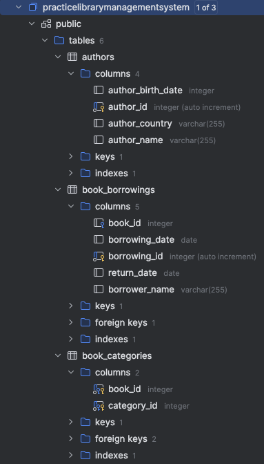
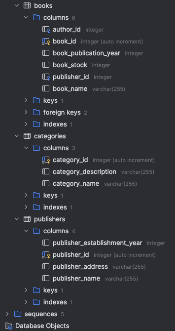

# Library Management System (JPA/Hibernate)

## Purpose

Manage books, authors, categories, publishers, and borrowing records in a simple library setup.

## Entities

- **Book**: `id, name, publicationYear, stock`
- **Author**: `id, name, birthDate, country`
- **Category**: `id, name, description`
- **Publisher**: `id, establishmentYear, address`
- **BookBorrowing**: `id, borrowerName, borrowingDate, returnDate`

## Relationships

- **Book — Author**: Many-to-One (a book has one author; an author has many books)
- **Book — Publisher**: Many-to-One (a book has one publisher; a publisher has many books)
- **Book — Category**: Many-to-Many (a book can have many categories; a category can have many books)
- **Book — BookBorrowing**: One-to-Many / Many-to-One (a book can have many borrowings; each borrowing belongs to one
  book)

## Fetch and Cascade (as used in the project)

- All associations use `FetchType.LAZY`.
- **Book → BookBorrowing**: `cascade = ALL`, `orphanRemoval = true`  
  Deleting a Book removes its borrowings; removing a borrowing from the list or clearing its parent deletes it.
- **Book ↔ Category**: `cascade = { PERSIST, MERGE }` (no remove cascade)  
  Join rows are managed; Category rows are not deleted when a Book is deleted.
- **Book → Author / Book → Publisher**: no cascade  
  Authors and publishers are independent; persist them separately.

## Project Structure

```
src/
  main/
    java/
      entity/
        Author.java
        Book.java
        BookBorrowing.java
        Category.java
        Publisher.java
      App.java
    resources/
      META-INF/
        persistence.xml
```

## Requirements

- Java 17+
- Maven 3+
- Jakarta Persistence 3, Hibernate 6
- Any JDBC database (H2 for demo, or PostgreSQL/MySQL with proper config)

## Screenshots

<p align="center">
  

</p>

## Thanks

This project was created with the support of [Patika.dev](https://www.patika.dev), as part of their free software development education platform. Special thanks to their community and resources.

---

## License

This project is currently not licensed.  
You are free to review and learn from the code.
